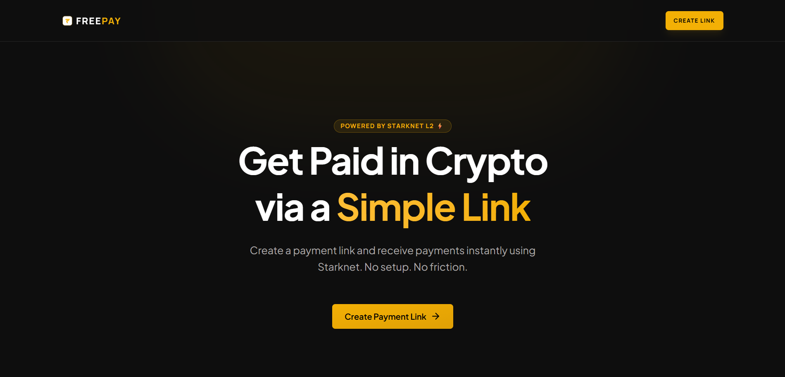
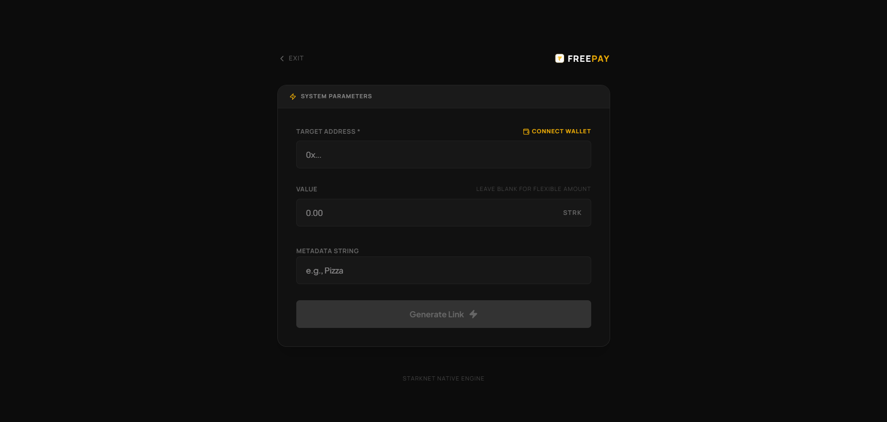
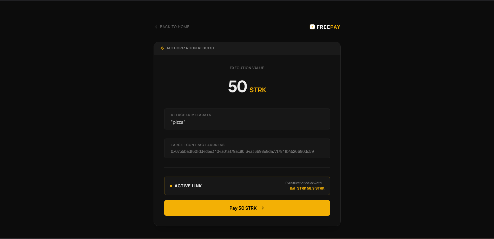
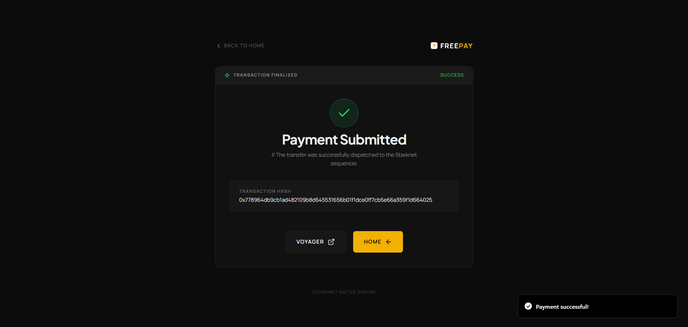

  

# FreePay — Crypto Payment Links

FreePay is a lightweight, link-first crypto payment infrastructure that enables anyone to receive payments globally using Starknet and Starkzap.

---

## Overview

FreePay simplifies crypto payments into a single, shareable link. There is no complex setup and no need for intermediaries. Simply create a payment link, share it, and receive funds instantly.

| Home Page | Create Page |
| :---: | :---: |
|  |  |

| Pay Page | Success Page |
| :---: | :---: |
|  |  |
---

## Problem Statement

Receiving global payments today presents several challenges:

*   **Inefficiency:** Slow settlement times heavily dependent on traditional banking hours.
*   **Cost:** Expensive intermediary fees associated with cross-border transfers.
*   **Friction:** Geographic limitations imposed by fiat payment gateways (e.g., PayPal, Stripe, UPI).
*   **Complexity:** Standard crypto payments often require users to navigate confusing wallet addresses, network selections, and gas fee estimations.

---

## Solution

FreePay abstracts away technical complexities into a streamlined user experience:

> **Generate a payment link → Share it → Get paid instantly in crypto**

By leveraging the Starknet Layer 2 network and the Starkzap SDK, FreePay provides a seamless, high-speed, and cost-effective payment flow.

---

## Key Features

*   **Instant Generation:** Create crypto payment links in seconds.
*   **Versatile Distribution:** Share payment requests via URL, WhatsApp, or dynamically generated QR codes.
*   **Wallet Integration:** Seamless end-to-end payment execution using Starknet wallets.
*   **High Performance:** Fast and low-cost transactions powered by Starknet rollups.
*   **Verifiable:** Instant transaction confirmation with on-chain hash verification.

---

## Technical Stack

*   **Frontend Framework:** Next.js (App Router)
*   **Language:** TypeScript
*   **Styling:** Tailwind CSS, shadcn/ui
*   **Blockchain Integration:** Starkzap SDK (Starknet)

---

## Starkzap Integration

This project demonstrates practical abstractions built on top of the Starkzap SDK, including:

*   Secure wallet connections and session management.
*   Direct smart contract transaction execution.
*   An optimized UX layer designed to bridge the gap between complex web3 infrastructure and everyday payment utility.

---

## Operational Flow

1.  **Create Link:** The payee enters an execution amount (optional) and metadata (note) to generate a unique payment vector.
2.  **Share:** The payee distributes the generated link across any communication channel.
3.  **Pay:** The payer clicks the link, connects their wallet, and authorizes the transaction.
4.  **Confirm:** A success interface displays the transaction hash for immutable on-chain verification.

---

## Primary Use Cases

*   **Freelancers:** Receiving borderless international payments.
*   **Content Creators:** Accepting direct support and donations without platform fees.
*   **Small Businesses:** Facilitating B2C crypto transactions seamlessly.
*   **Peer-to-Peer:** Splitting bills or sending funds globally.

---

## Project Structure

*   `/` — Link Generation Interface
*   `/pay` — Payment Execution Portal
*   `/create` — Link Creation Utility
*   `/success` — Transaction Confirmation Screen

---

## Design Principles

*   **Minimalist Interface:** Clean, intuitive UI focused entirely on the transaction.
*   **Mobile-First:** Fully responsive design optimized for mobile web interactions.
*   **Stateless Architecture:** Operates entirely client-side; no backend database required.
*   **Frictionless UX:** Reduces the number of clicks required from link generation to payment execution.

---

## License

This project is licensed under the MIT License.
